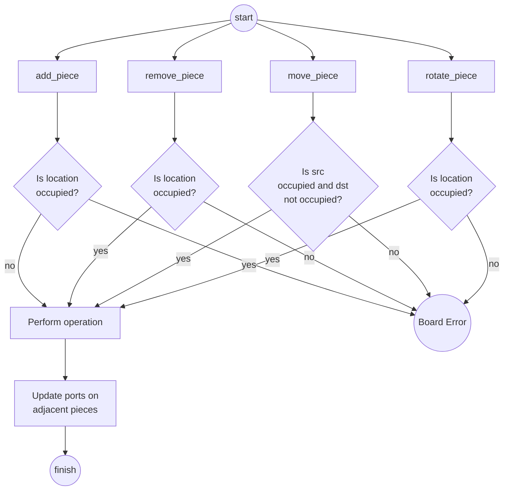
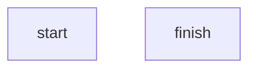
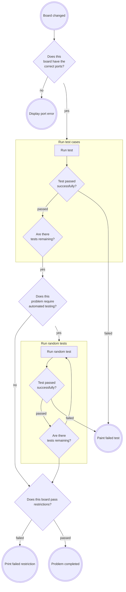

## component eval board

## How do we add/remove/move/rotate pieces?

```mermaid
flowchart TD
    start((start))
    perform_operation[Perform operation]
    update_ports[Update ports on \nadjacent pieces]
    board_error((Board Error))
    finish((finish))

    start --> add_piece
    add_piece --> check_add{Is location \noccupied?}
    check_add -- yes --> board_error
    check_add -- no --> perform_operation

    start --> remove_piece
    remove_piece --> check_remove{Is location \noccupied?}
    check_remove -- no --> board_error
    check_remove -- yes --> perform_operation

    start --> move_piece
    move_piece --> check_move{Is src \noccupied and dst \nnot occupied?}
    check_move -- no --> board_error
    check_move -- yes --> perform_operation

    start --> rotate_piece
    rotate_piece --> check_rotate{Is location \noccupied?}
    check_rotate -- no --> board_error
    check_rotate -- yes --> perform_operation

    perform_operation --> update_ports
    update_ports --> finish
```

## How do we add a wire piece
- which ports should be updated?

```mermaid
flowchart TD
    start
    finish

```

## How do we check that the board meets the spec?

```mermaid
flowchart TD
    start(((Board changed)))
    check_same_ports{Does this \nboard have the \ncorrect ports?}
    run_test_cases[Run test cases]
    check_requires_random_testing{Does this \nproblem require \nautomated testing?}
    check_restrictions{Does this board pass restrictions?}

    paint_failed_test_case(((Paint failed test)))

    subgraph run_test_cases [Run test cases]
        run_test[Run test]
        check_test{Test passed \nsuccessfully?}
        check_test_complete{Are there \ntests remaining?}

        run_test --> check_test
        check_test -- passed --> check_test_complete
    end

    subgraph run_random_tests [Run random tests]
        run_random_test[Run random test]
        check_random_test{Test passed \nsuccessfully?}
        check_random_tests_compete{Are there \ntests remaining?}

        run_random_test --> check_random_test
        check_random_test -- passed --> check_random_tests_compete
        check_random_tests_compete --> run_random_test
    end


    start --> check_same_ports
    check_same_ports -- no  --> same_ports_error(((Display port error)))
    check_same_ports -- yes ---> run_test_cases
    check_test -- failed --> paint_failed_test_case
    check_random_test -- failed --> paint_failed_test_case

    check_random_tests_compete --> check_restrictions

    check_test_complete -- yes --> check_requires_random_testing
    check_requires_random_testing -- yes --> run_random_tests
    check_requires_random_testing -- no --> check_restrictions

    check_restrictions -- failed --> print_failed_restriction(((Print failed restriction)))
    check_restrictions -- passed --> finish(((Problem completed)))
```