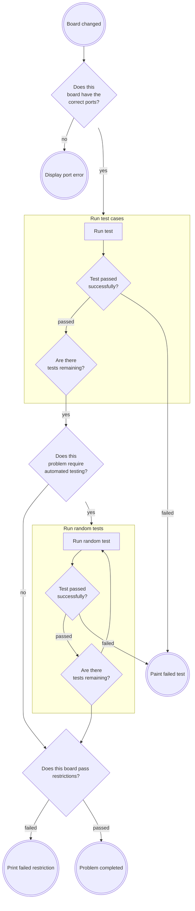

## component eval board

```mermaid
flowchart TD
    start(((Board changed)))
    check_same_ports{Does this \nboard have the \ncorrect ports?}
    run_test_cases[Run test cases]
    check_requires_random_testing{Does this \nproblem require \nautomated testing?}
    check_restrictions{Does this board pass restrictions?}

    paint_failed_test_case(((Paint failed test)))

    subgraph run_test_cases [Run test cases]
        run_test[Run test]
        check_test{Test passed \nsuccessfully?}
        check_test_complete{Are there \ntests remaining?}

        run_test --> check_test
        check_test -- passed --> check_test_complete
    end

    subgraph run_random_tests [Run random tests]
        run_random_test[Run random test]
        check_random_test{Test passed \nsuccessfully?}
        check_random_tests_compete{Are there \ntests remaining?}

        run_random_test --> check_random_test
        check_random_test -- passed --> check_random_tests_compete
        check_random_tests_compete --> run_random_test
    end


    start --> check_same_ports
    check_same_ports -- no  --> same_ports_error(((Display port error)))
    check_same_ports -- yes ---> run_test_cases
    check_test -- failed --> paint_failed_test_case
    check_random_test -- failed --> paint_failed_test_case

    check_random_tests_compete --> check_restrictions

    check_test_complete -- yes --> check_requires_random_testing
    check_requires_random_testing -- yes --> run_random_tests
    check_requires_random_testing -- no --> check_restrictions

    check_restrictions -- failed --> print_failed_restriction(((Print failed restriction)))
    check_restrictions -- passed --> finish(((Problem completed)))
```