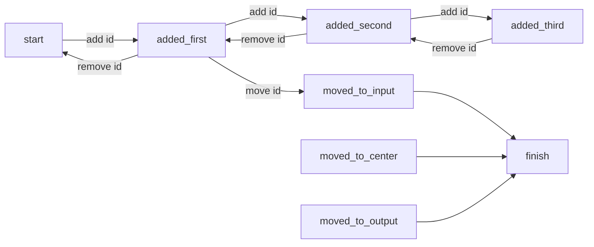

# from A to B

initialMessageQueue ->
    "click on the id button" ->
        glow id buttons

on add piece id 1 ->
    "move piece to (2, 1)"
        glow (2, 1)

on move piece:
    - ""
    - "add another piece" -> glow id button

on add Piece

## what does the rules engine need to do?
    - count all the previous rules that match predicates
    - and/or/not other rules 
    - the current delta

# left elbow piece
a' = or false a 
a' = and true a 

# right elbow piece

## how to do xor
a' = or (and a (not b)) (and (not a) b)
a' = (a && ~b) || (~a && b)
a' = ~(a && ~b) && ~(~a && b)
a' = (~a || b) && (a || ~b)

# how to do cross over
a' = xor (a xor b) b
b' = xor (a xor b) a

