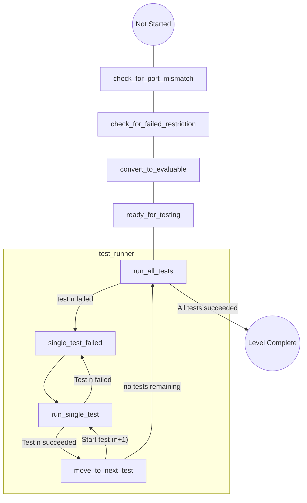

```mermaid
flowchart TD
  not_started((Not Started))

  check_for_port_mismatch
  check_for_failed_restriction
  convert_to_evaluable

  ready_for_testing

  level_complete((Level Complete))


  not_started --- check_for_port_mismatch
  check_for_port_mismatch --- check_for_failed_restriction
  check_for_failed_restriction --- convert_to_evaluable
  convert_to_evaluable --- ready_for_testing
  ready_for_testing --- run_all_tests


  subgraph test_runner
    run_all_tests
    run_single_test
    single_test_failed
    move_to_next_test

    run_all_tests -- test n failed --> single_test_failed
    single_test_failed --> run_single_test
    run_single_test -- Test n failed --> single_test_failed
    run_single_test -- Test n succeeded --> move_to_next_test
    move_to_next_test --  Start test (n+1) --> run_single_test
    move_to_next_test -- no tests remaining --> run_all_tests


  end
  run_all_tests -- All tests succeeded --> level_complete
```