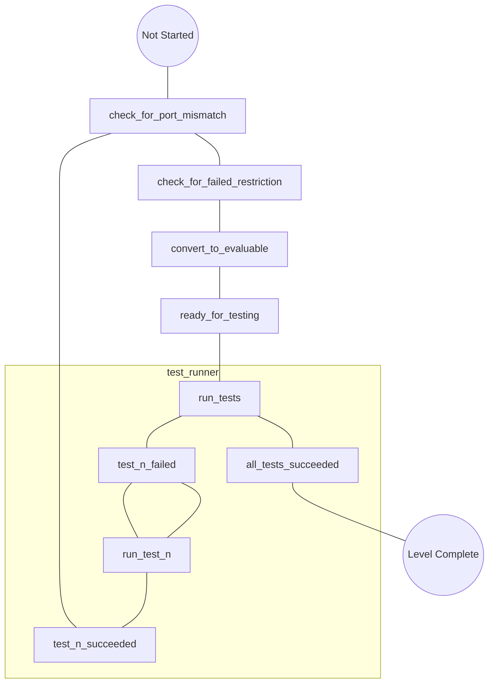

```mermaid
flowchart TD
  not_started((Not Started))

  check_for_port_mismatch
  check_for_failed_restriction
  convert_to_evaluable

  ready_for_testing


  level_complete((Level Complete))


  not_started --- check_for_port_mismatch
  test_n_succeeded --- check_for_port_mismatch
  check_for_port_mismatch --- check_for_failed_restriction
  check_for_failed_restriction --- convert_to_evaluable
  convert_to_evaluable --- ready_for_testing
  ready_for_testing --- run_tests


  subgraph test_runner
    run_tests
    all_tests_succeeded
    test_n_failed
    test_n_succeeded
    run_test_n

    run_tests --- test_n_failed
    run_tests --- all_tests_succeeded
    test_n_failed --- run_test_n
    run_test_n --- test_n_failed
    run_test_n --- test_n_succeeded


  end
    all_tests_succeeded --- level_complete
```